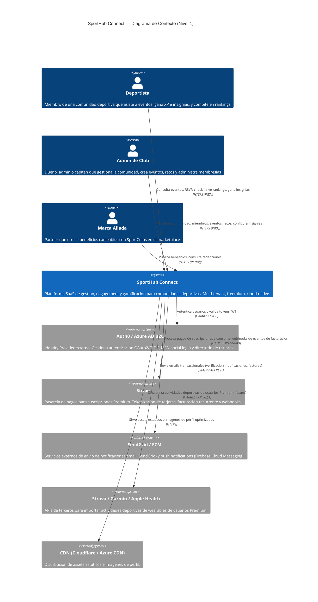
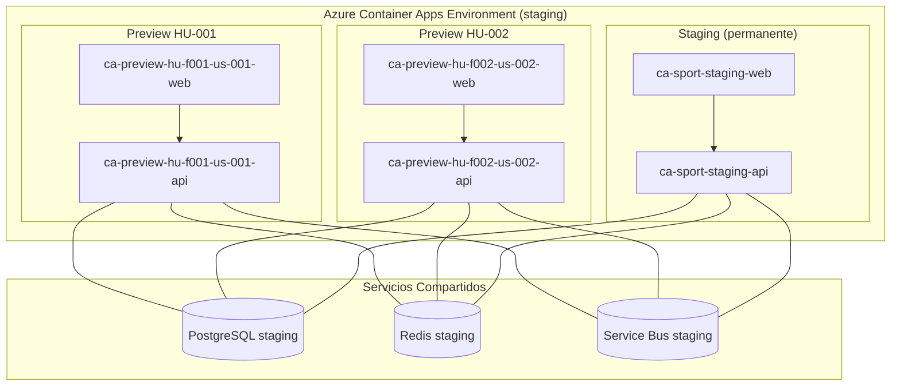

# Arquitectura del Sistema SportHub Connect

> Ultima actualizacion: 2026-07-21
> Version: 1.0.0

## 1. Proposito y alcance

### 1.1 Proposito

**SportHub Connect** es una plataforma SaaS integral que unifica la gestion de comunidades deportivas en un solo ecosistema. La plataforma combina gestion operativa (miembros, eventos, calendarios), engagement social (gamificacion, retos, insignias) y monetizacion (suscripciones, beneficios) para clubes, comunidades y grupos deportivos amateurs y semi-profesionales.

El sistema sigue un modelo **freemium multi-tenant**: cada comunidad es un tenant aislado logicamente. El nucleo gratuito ofrece herramientas de alto valor para comunidades pequeñas, mientras que las suscripciones Premium desbloquean funcionalidades avanzadas.

### 1.2 Alcance arquitectonico

Este documento define la arquitectura del sistema completo: backend, frontend, infraestructura, patrones transversales y decisiones arquitectonicas (ADRs). El alcance incluye:

- **8 Bounded Contexts** siguiendo Domain-Driven Design
- **Monorepo .NET 10 LTS** con estructura modular preparada para evolucion a microservicios
- **API RESTful** con OpenAPI 3.0 + SignalR para comunicacion en tiempo real
- **SPA/PWA** en React 19 + TypeScript + Next.js 16 para frontend web
- **Infraestructura cloud-native** con Docker, contenedores y servicios gestionados

### 1.3 Stakeholders arquitectonicos

| Stakeholder | Rol | Interes arquitectonico |
|-------------|-----|------------------------|
| Arquitecto de software | Definicion y evolucion del sistema | ADRs, C4, stack, patrones |
| Equipo de desarrollo (4-6 devs) | Implementacion | Topologia, convenciones, tooling |
| DevOps / Cloud Engineer | Infraestructura y despliegue | Contenedores, CI/CD, observabilidad |
| Product Owner | Priorizacion funcional | Roadmap, restricciones de negocio |
| Security Officer | Cumplimiento normativo | Cifrado, GDPR, PCI-DSS, autenticacion |

---

## 2. Diagrama de contexto (C4 - Nivel 1)



---

## 3. Diagrama de contenedores (C4 - Nivel 2)

```mermaid
C4Container
    title SportHub Connect — Diagrama de Contenedores (Nivel 2)

    Person(deportista, "Deportista", "Usuario de la plataforma")
    Person(admin, "Admin de Club", "Administrador de comunidad")

    System_Ext(auth0, "Auth0 / Azure AD B2C", "Identity Provider")
    System_Ext(stripe, "Stripe", "Pasarela de Pagos")

    Container_Boundary(platform, "SportHub Connect Platform") {
        Container(webapp, "Web Application", "React 19 + TypeScript + Next.js 16", "SPA/PWA que consume la API REST y SignalR. SSR/SSG para SEO de comunidades publicas. Service Worker para capacidades offline basicas.")
        Container(api, "API Gateway / BFF", "ASP.NET Core 10 Minimal API + YARP", "Entry point unificado. Enruta requests a los modulos internos. Autenticacion JWT. Rate limiting. OpenAPI 3.0. SignalR hub central.")
        Container(identity, "Identity Module", "ASP.NET Core 10 (Clean Architecture)", "Gestion de usuarios, perfiles deportivos, niveles de habilidad. Consume Auth0 para autenticacion.")
        Container(community, "Community Module", "ASP.NET Core 10 (Clean Architecture)", "Gestion de comunidades, membresias, roles comunitarios y sub-grupos.")
        Container(event, "Event Module", "ASP.NET Core 10 (Clean Architecture)", "Planificacion de eventos, calendario, RSVP, check-in con QR/geolocalizacion. SAGA de asistencia.")
        Container(gamification, "Gamification Module", "ASP.NET Core 10 (Clean Architecture)", "Motor de insignias, reglas, XP, niveles y retos dinamicos. Evaluacion de BadgeRules.")
        Container(leaderboard, "Leaderboard Module", "ASP.NET Core 10 (Clean Architecture)", "Rankings en tiempo real con Redis Sorted Sets. Gestion de SportCoins y transacciones.")
        Container(payments, "Payments Module", "ASP.NET Core 10 (Clean Architecture)", "Suscripciones, facturacion, integracion con Stripe. Feature gating por plan.")
        Container(notifications, "Notifications Module", "ASP.NET Core 10 (Clean Architecture)", "Envio de notificaciones push/email/in-app. Feed de actividad de comunidad. Preferencias de notificacion.")
        Container(integrations, "Integrations Module", "ASP.NET Core 10 (Clean Architecture)", "Conexion con wearables, marketplace de beneficios y aliados comerciales.")
        ContainerDb(postgres, "PostgreSQL Database", "PostgreSQL 16", "Base de datos relacional principal. Un schema por bounded context. Full-Text Search para busquedas. Row-Level Security para multi-tenant.")
        ContainerDb(redis, "Redis Cache", "Redis 7", "Cache distribuido. Sorted Sets para leaderboards en tiempo real. SignalR backplane. Pub/Sub interno.")
        ContainerDb(rabbitmq, "RabbitMQ", "RabbitMQ 3.13", "Message broker para eventos de dominio entre bounded contexts. Exchange de topicos con colas durables.")
        ContainerDb(blob, "Blob Storage", "Azure Blob / AWS S3 / MinIO(dev)", "Almacenamiento de avatares, logos de comunidades, assets de insignias, backups.")
    }

    Rel(deportista, webapp, "Usa la plataforma", "HTTPS")
    Rel(admin, webapp, "Administra la comunidad", "HTTPS")
    Rel(webapp, api, "API REST + SignalR WebSocket", "HTTPS/WSS")
    Rel(api, auth0, "Valida tokens JWT", "OAuth2/OIDC")
    Rel(api, identity, "Enruta peticiones de usuarios", "In-process / HTTP")
    Rel(api, community, "Enruta peticiones de comunidades", "In-process / HTTP")
    Rel(api, event, "Enruta peticiones de eventos", "In-process / HTTP")

    Rel(identity, postgres, "Persiste usuarios y perfiles", "SQL (EF Core)")
    Rel(community, postgres, "Persiste comunidades y membresias", "SQL (EF Core)")
    Rel(event, postgres, "Persiste eventos y asistencias", "SQL (EF Core)")
    Rel(gamification, postgres, "Persiste insignias y XP", "SQL (EF Core)")
    Rel(leaderboard, postgres, "Persiste wallets y transacciones", "SQL (EF Core)")
    Rel(leaderboard, redis, "Rankings en vivo con Sorted Sets", "Redis Protocol")
    Rel(payments, postgres, "Persiste suscripciones y facturas", "SQL (EF Core)")
    Rel(payments, stripe, "Crea/gestiona suscripciones, consume webhooks", "HTTPS")
    Rel(notifications, postgres, "Persiste notificaciones y preferencias", "SQL (EF Core)")
    Rel(integrations, postgres, "Persiste conexiones y beneficios", "SQL (EF Core)")

    Rel(identity, rabbitmq, "Publica UserRegistered, ProfileUpdated", "AMQP")
    Rel(community, rabbitmq, "Publica MemberJoined, MemberLeft, CommunityCreated", "AMQP")
    Rel(event, rabbitmq, "Publica EventCreated, CheckInRecorded, NoShowDetected", "AMQP")
    Rel(gamification, rabbitmq, "Publica BadgeEarned, XPEarned, LevelUp, ChallengeCompleted", "AMQP")
    Rel(leaderboard, rabbitmq, "Publica CoinsEarned, LeaderboardUpdated, TopRankAchieved", "AMQP")
    Rel(payments, rabbitmq, "Publica SubscriptionCreated, SubscriptionCanceled", "AMQP")

    Rel(gamification, rabbitmq, "Consume CheckInRecorded, MemberJoined para otorgar XP/insignias", "AMQP")
    Rel(leaderboard, rabbitmq, "Consume XPEarned, BadgeEarned, CheckInRecorded", "AMQP")
    Rel(notifications, rabbitmq, "Consume eventos de todos los modulos para enviar notificaciones", "AMQP")

    Rel(webapp, blob, "Carga imagenes y assets", "HTTPS")
    Rel(api, blob, "Sirve/almacena archivos de usuario", "HTTPS")

    UpdateLayoutConfig($c4ShapeInRow="3", $c4BoundaryInRow="2")
```



---

## 4. Topologia de servicios

### 4.1 Estructura del Monorepo

El proyecto se organiza como un **monorepo .NET** con una unica solution y proyectos por bounded context. Cada modulo sigue **Clean Architecture** con capas internas claramente separadas. Esta estructura permite extraer cualquier modulo como microservicio independiente en el futuro con minimo esfuerzo.

```
sport-hub-connect/
│
├── SportHub.sln                            # Solucion unica del monorepo
│
├── src/
│   ├── Api/                                # API Gateway / BFF
│   │   └── SportHub.Api/                   # ASP.NET Core 10 Minimal API + YARP
│   │       ├── Program.cs                  # Composition root, middleware pipeline
│   │       ├── appsettings.json
│   │       ├── Routes/                     # Endpoint definitions per module
│   │       ├── Hubs/                       # SignalR hubs (LeaderboardHub, NotificationHub)
│   │       ├── Middleware/                 # Exception handling, correlation ID, tenant resolution
│   │       └── SportHub.Api.csproj
│   │
│   ├── Modules/                            # Bounded contexts como modulos
│   │   ├── Identity/
│   │   │   ├── SportHub.Identity.Domain/           # Entidades, Value Objects, Interfaces de repositorios
│   │   │   ├── SportHub.Identity.Application/      # Casos de uso, Commands/Queries (CQRS), DTOs
│   │   │   ├── SportHub.Identity.Infrastructure/   # EF Core DbContext, repositorios, integracion Auth0
│   │   │   └── SportHub.Identity.Contracts/        # DTOs publicos, eventos de dominio, interfaces de API
│   │   │
│   │   ├── Community/
│   │   │   ├── SportHub.Community.Domain/
│   │   │   ├── SportHub.Community.Application/
│   │   │   ├── SportHub.Community.Infrastructure/
│   │   │   └── SportHub.Community.Contracts/
│   │   │
│   │   ├── EventPlanning/
│   │   │   ├── SportHub.EventPlanning.Domain/
│   │   │   ├── SportHub.EventPlanning.Application/
│   │   │   ├── SportHub.EventPlanning.Infrastructure/
│   │   │   └── SportHub.EventPlanning.Contracts/
│   │   │
│   │   ├── Gamification/
│   │   │   ├── SportHub.Gamification.Domain/
│   │   │   ├── SportHub.Gamification.Application/
│   │   │   ├── SportHub.Gamification.Infrastructure/
│   │   │   └── SportHub.Gamification.Contracts/
│   │   │
│   │   ├── Leaderboards/
│   │   │   ├── SportHub.Leaderboards.Domain/
│   │   │   ├── SportHub.Leaderboards.Application/
│   │   │   ├── SportHub.Leaderboards.Infrastructure/
│   │   │   └── SportHub.Leaderboards.Contracts/
│   │   │
│   │   ├── Payments/
│   │   │   ├── SportHub.Payments.Domain/
│   │   │   ├── SportHub.Payments.Application/
│   │   │   ├── SportHub.Payments.Infrastructure/
│   │   │   └── SportHub.Payments.Contracts/
│   │   │
│   │   ├── Notifications/
│   │   │   ├── SportHub.Notifications.Domain/
│   │   │   ├── SportHub.Notifications.Application/
│   │   │   ├── SportHub.Notifications.Infrastructure/
│   │   │   └── SportHub.Notifications.Contracts/
│   │   │
│   │   └── Integrations/
│   │       ├── SportHub.Integrations.Domain/
│   │       ├── SportHub.Integrations.Application/
│   │       ├── SportHub.Integrations.Infrastructure/
│   │       └── SportHub.Integrations.Contracts/
│   │
│   └── Shared/                             # Kernel compartido (solo lo justificado)
│       ├── SportHub.Shared.Abstractions/   # Interfaces comunes (IDomainEvent, IAggregateRoot, IUnitOfWork)
│       ├── SportHub.Shared.Infrastructure/ # Cross-cutting: logging, health checks, OpenTelemetry, serializacion
│       └── SportHub.Shared.Contracts/      # Enums, tipos y DTOs compartidos entre modulos
│
├── tests/
│   ├── SportHub.Identity.UnitTests/
│   ├── SportHub.Identity.IntegrationTests/
│   ├── SportHub.Community.UnitTests/
│   ├── SportHub.Community.IntegrationTests/
│   ├── SportHub.EventPlanning.UnitTests/
│   ├── SportHub.EventPlanning.IntegrationTests/
│   ├── SportHub.Gamification.UnitTests/
│   ├── SportHub.Gamification.IntegrationTests/
│   ├── SportHub.Leaderboards.UnitTests/
│   ├── SportHub.Leaderboards.IntegrationTests/
│   ├── SportHub.Api.ContractTests/         # Pruebas de contrato contra OpenAPI spec
│   └── SportHub.E2ETests/                  # Pruebas end-to-end (Playwright + API)
│
├── frontend/
│   └── sport-hub-web/                      # React 19 + TypeScript + Next.js 16 PWA
│       ├── src/
│       │   ├── app/                        # Next.js App Router (pages/layouts)
│       │   ├── components/                 # Componentes React reutilizables
│       │   ├── hooks/                      # Custom hooks (useSignalR, useLeaderboard, useAuth)
│       │   ├── services/                   # Clientes API autogenerados (OpenAPI Generator)
│       │   ├── stores/                     # Estado global (Zustand o React Context)
│       │   └── types/                      # Tipos TypeScript generados desde OpenAPI
│       ├── public/
│       ├── next.config.js
│       ├── Dockerfile
│       └── package.json
│
├── infrastructure/
│   ├── docker-compose.yml                  # Entorno de desarrollo local completo
│   ├── docker-compose.prod.yml             # Overrides para produccion
│   ├── Dockerfile.api                      # Imagen del backend
│   ├── nginx.conf                          # Reverse proxy local
│   ├── postgres/
│   │   └── init/                           # Scripts de inicializacion de schemas
│   ├── rabbitmq/
│   │   └── definitions.json               # Definicion de exchanges, queues y bindings
│   └── redis/
│       └── redis.conf
│
├── .github/
│   ├── workflows/
│   │   ├── ci.yml                          # Build + test en PRs
│   │   ├── cd-staging.yml                  # Deploy a staging
│   │   └── cd-production.yml              # Deploy a produccion
│   └── dependabot.yml
│
├── docs/
│   ├── architecture.md                     # Este documento (ADRs, C4, stack)
│   ├── inception/                          # Artefactos fundacionales
│   └── features/                           # Documentacion por feature
│
└── .editorconfig
```

### 4.2 Flujo de dependencias entre modulos

Los modulos NO se referencian directamente entre si (ni Assembly Reference ni referencia de proyecto). La comunicacion entre bounded contexts se realiza exclusivamente mediante:

1. **Eventos de dominio via RabbitMQ**: Para flujos asincronos y eventualmente consistentes (ej. `CheckInRecorded` → Gamification otorga XP)
2. **Consultas HTTP internas via API Gateway**: Para datos sincronos necesarios en queries cross-modulo (ej. el modulo de Event Planning necesita el nombre del miembro desde Identity para enriquecer respuestas)
3. **Contratos compartidos**: Los modulos solo dependen de `SportHub.Shared.Contracts` (tipos, eventos) y `SportHub.{Module}.Contracts` de otros modulos si necesitan consumir sus eventos o DTOs.

```
┌─────────────────────────────────────────────────────────────────────┐
│                        SportHub.Api (BFF)                           │
│  ┌──────────────────────────────────────────────────────────────┐   │
│  │               Composition Root & Middleware                   │   │
│  └──────────────────────────────────────────────────────────────┘   │
│                                                                      │
│  ┌──────────┐ ┌──────────┐ ┌──────────┐ ┌──────────┐              │
│  │ Identity │ │Community │ │  Event   │ │Gamification│             │
│  │ Module   │ │ Module   │ │ Planning │ │  Module   │              │
│  └────┬─────┘ └────┬─────┘ └────┬─────┘ └────┬─────┘              │
│       │            │            │            │                      │
│  ┌────┴─────┐ ┌────┴─────┐ ┌───┴──────┐ ┌───┴──────┐              │
│  │Leaderboard│ │ Payments │ │Notif.    │ │Integrat. │              │
│  │ Module   │ │ Module   │ │Module    │ │ Module   │              │
│  └──────────┘ └──────────┘ └──────────┘ └──────────┘              │
│                                                                      │
│  ─────────── Comunicacion sincrona (in-process HTTP) ───────────    │
│  ═══════════ Comunicacion asincrona (RabbitMQ Domain Events) ═══════  │
└─────────────────────────────────────────────────────────────────────┘
```

### 4.3 Base de datos: esquema multi-schema

PostgreSQL utiliza un **schema** dedicado por bounded context para mantener isolation logica dentro de la misma base de datos fisica:

| Schema | Bounded Context | Tablas principales |
|--------|----------------|--------------------|
| `identity` | Identity & Users | users, profiles, user_roles, personal_records |
| `community` | Community Management | communities, memberships, community_roles, sub_groups, sub_group_members |
| `events` | Event Planning | events, calendars, rsvps, check_ins, attendance_records |
| `gamification` | Gamification | badges, badge_rules, user_badges, xp_records, levels, challenges, challenge_participants |
| `economy` | Leaderboards & Economy | leaderboards, rankings, sport_coin_wallets, coin_transactions |
| `payments` | Payments | subscriptions, invoices, payment_methods |
| `notifications` | Notifications | notifications, notification_preferences, feed_items |
| `integrations` | Integrations | wearable_connections, wearable_activities, benefit_partners, benefit_catalogs, benefit_redemptions |

Cada modulo tiene su propio `DbContext` de EF Core configurado con `HasDefaultSchema()` y migraciones independientes. Esto permite extraer un schema a su propia base de datos en el futuro sin cambios de codigo (solo cambia la connection string).

---

## 5. Stack tecnologico

### 5.1 Backend

| Capa | Tecnologia | Version | Justificacion | Skill |
|------|-----------|---------|---------------|-------|
| Runtime | .NET | 10.0 LTS | Alto rendimiento (TechEmpower top 10), tipado fuerte para dominio DDD complejo, compilacion AOT madura, soporte empresarial LTS hasta Nov 2028 | `dotnet-microservice` |
| Framework API | ASP.NET Core (Minimal API) | 10.0 | Minimal APIs reducen boilerplate, excelente performance, OpenAPI 3.0 nativo con Swashbuckle/Scalar, middleware pipeline maduro | `dotnet-microservice` |
| ORM | Entity Framework Core | 10.0 | Migraciones, change tracking, owned types para Value Objects (DDD), TPH/TPT para herencia, intercepciones, LINQ | `dotnet-microservice` |
| CQRS / Mediator | MediatR | 12.x | Separacion limpia de Commands (escritura) y Queries (lectura). Behaviors para validacion, logging, y transaction handling cross-cutting | `dotnet-microservice` |
| Real-time | SignalR | 10.0 | WebSockets nativos con fallback a SSE/Long Polling. Leaderboards en vivo, notificaciones push, actualizaciones de RSVP | `dotnet-microservice` |
| Message Broker Client | MassTransit + RabbitMQ | 8.x + 3.13 | Abstraccion sobre RabbitMQ con soporte para sagas, retry policies, DLQ. Tipado fuerte para eventos de dominio | `dotnet-microservice` |
| Serializacion | System.Text.Json | 10.0 | Nativo de .NET, source generators para AOT, rendimiento superior a Newtonsoft | `dotnet-microservice` |
| Validacion | FluentValidation | 11.x | Validacion declarativa de commands y DTOs. Integracion nativa con MediatR pipeline | `dotnet-microservice` |
| Mapping | Mapster / Mapperly | 7.x / 3.x | Mapeo objeto-objeto con source generators (compilacion AOT), rendimiento superior a AutoMapper | `dotnet-microservice` |
| Identity Provider SDK | Auth0 SDK / Microsoft.Identity.Web | — | Integracion OAuth2/OIDC con el Identity Provider externo. Validacion JWT y claims transformation | `dotnet-microservice` |
| Gateway / Proxy | YARP (Reverse Proxy) | 2.x | Reverse proxy ligero para enrutamiento entre modulos cuando se extraigan como servicios independientes. Rate limiting integrado. | `dotnet-microservice` |
| Observability | OpenTelemetry | 1.x | Trazas distribuidas, metricas y logs exportados a Azure Monitor/Datadog/Jaeger. Instrumentacion automatica de ASP.NET Core, EF Core, HttpClient | `dotnet-microservice` |
| Health Checks | ASP.NET Core Health Checks | 10.0 | Liveness, readiness y startup probes. Checks para PostgreSQL, Redis, RabbitMQ y APIs externas | `dotnet-microservice` |
| Background Jobs | Hangfire / Quartz.NET | 1.x / 3.x | Procesamiento nocturno de leaderboards, expiracion de notificaciones, envio de recordatorios de eventos | `dotnet-microservice` |
| Testing (Unit) | xUnit + Moq + AutoFixture | 2.x + 4.x + 4.x | TDD con RED-GREEN-REFACTOR. Moq para mockeo estricto. AutoFixture para datos de prueba | `tdd-dotnet` |
| Testing (Integration) | xUnit + Testcontainers | 2.x + 3.x | Testcontainers para PostgreSQL, Redis y RabbitMQ en integration tests. Tests reproducibles sin dependencias externas | `tdd-dotnet` |
| Testing (Contract) | PactNet / custom | 4.x | Consumer-driven contract testing entre modulos | `tdd-dotnet` |

### 5.2 Frontend

| Capa | Tecnologia | Version | Justificacion | Skill |
|------|-----------|---------|---------------|-------|
| Framework | React + TypeScript | 19.x + 5.x | Ecosistema maduro para PWAs, Server Components, Actions, tipado fuerte | `react` + `typescript` |
| Meta-framework | Next.js | 16.x | App Router, SSR/SSG, cache avanzado, Server Actions, optimizacion de imagenes | `nextjs` |
| Estado global | Zustand | 5.x | Ligero (~1 KB), API minimalista, soporte TypeScript | *(Sin skill)* |
| Real-time | SignalR JavaScript Client | 8.0 | Conexion WebSocket para leaderboards en vivo, notificaciones push, actualizaciones de eventos | *(Sin skill)* |
| UI Components | shadcn/ui + Tailwind CSS | — + 4.x | Componentes accesibles (WCAG 2.1 AA), personalizables, tailwind para estilos utilitarios | `shadcn` + `tailwind` |
| Data Fetching | TanStack Query (React Query) | 5.x | Cache, refetching, paginacion infinita, mutaciones optimistas. Integracion con SignalR para invalidacion de cache | `tanstack-query` |
| Formularios | React Hook Form + Zod | 7.x + 3.x | Manejo de formularios con validacion de esquema Zod. Tipos inferidos automaticamente | `react-hook-form` + `zod` |
| Testing (Unit) | Vitest + Testing Library | 2.x + 16.x | Tests unitarios y de componentes. Compatible con ecosistema Vite. Mas rapido que Jest | `vitest` |
| Testing (BDD) | Cucumber.js + Playwright | 11.x + 1.x | Automatizacion de criterios de aceptacion Gherkin (Given-When-Then) desde el frontend. Step definitions usan Playwright para interaccion real con el navegador | `bdd-javascript` |
| E2E | Playwright | 1.x | Tests end-to-end cross-browser. PWA, geolocalizacion mock, parallel execution | `playwright` |
| PWA | next-pwa + Workbox | — + 7.x | Service worker, cache offline, instalacion como app nativa | *(Sin skill)* |

### 5.3 Infraestructura y DevOps

| Capa | Tecnologia | Version | Justificacion | Skill |
|------|-----------|---------|---------------|-------|
| Contenedores | Docker + Docker Compose | 24.x + 2.x | Desarrollo local reproducible. Multi-stage builds para imagenes optimizadas | — |
| CI/CD | GitHub Actions | — | Incluido con GitHub. Builds paralelos, matrices de test, secrets gestionados, auto-runners | — |
| Orquestacion | Azure Container Apps (ACA) | — | Serverless containers para MVP. Frontend y backend en el mismo ACA Environment, misma VNet. Migrable a AKS si se requiere Kubernetes completo. Ver ADR-005 | — |
| IaC | Terraform / Bicep | — | Infraestructura como codigo para recursos cloud. Reproducible y versionable | — |
| API Management | Azure API Management / custom | — | Rate limiting, throttling, API keys para partners | — |
| Monitoreo | Azure Monitor / Grafana + Prometheus | — | Dashboards por bounded context. Alertas configuradas por latencia, errores y disponibilidad | — |
| CDN | Cloudflare / Azure CDN | — | Cache de assets estaticos e imagenes. WAF contra ataques DDoS | — |
| Git | Git Flow (estricto) | — | hu/* → feature/* → develop → release/* → main | `git-flow` |

### Nota sobre skills de frontend

Los skills de frontend estan completamente cubiertos: 18 skills de `Pythoughts-labs/react-frontend-skills` (React 19, Next.js 16, TypeScript, Tailwind v4, shadcn/ui, TanStack Query, React Hook Form, Zod, Vitest, Playwright, MSW, TDD, feature-arch) + 2 skills complementarios (`react-architecture-checklist`, `react-security-review`) + `bdd-javascript` para BDD (Cucumber.js + Playwright desde el frontend). Las tareas de backend estan cubiertas por `dotnet-microservice`, `tdd-dotnet`, `ef-migration-manager`, `dotnet-architecture-checklist`, `dotnet-security-review` y `minimal-api-scaffolder`.

---

## 6. ADR — Architecture Decision Records

### ADR-001: Monorepo con Clean Architecture modular (en lugar de microservicios puros en MVP)

**Estado**: Aceptado
**Fecha**: 2026-07-13

**Contexto**:
El dominio de SportHub Connect se compone de 8 bounded contexts identificados durante el DDD Event Storming. Existe la necesidad de balancear la velocidad de entrega del MVP (<= 6 meses) con la flexibilidad de evolucion futura hacia una arquitectura de microservicios. El equipo inicial es de 4-6 desarrolladores.

Se evaluaron tres alternativas:
1. **Microservicios puros desde el inicio**: Cada bounded context como servicio independiente con su propia base de datos, contenedor, CI/CD. Comunicacion solo via mensajeria (RabbitMQ).
2. **Monolito modular (Modular Monolith)**: Una unica aplicacion .NET con todos los bounded contexts como modulos internos que comparten la misma base de datos y se comunican in-process.
3. **Monorepo con modulos extraibles**: Monorepo con una unica solucion .NET donde cada modulo tiene capas separadas (Domain, Application, Infrastructure, Contracts) y su propio schema en PostgreSQL, pero se despliega como una unica aplicacion. Preparado para extraer modulos como servicios independientes.

**Decision**:
Se elige la **opcion 3: Monorepo con modulos extraibles (Clean Architecture modular)**.

**Justificacion**:
- **Velocidad MVP**: Un solo deploy, una sola pipeline CI/CD, debugging simple, sin latencia de red entre modulos.
- **Aislamiento logico**: Cada modulo tiene su propio schema en PostgreSQL (via `HasDefaultSchema()`). Cada modulo tiene su propio DbContext. No hay accesos directos entre tablas de distintos modulos.
- **Extraibilidad**: Los modulos no tienen dependencias de assembly entre si. La comunicacion se hace via Domain Events (RabbitMQ) desde el dia 1. Para extraer un modulo como microservicio, solo se necesita:
  1. Cambiar la dependencia in-process a HTTP (las interfaces ya estan definidas)
  2. Migrar el schema a una base de datos independiente
  3. Crear un contenedor separado con su propio deploy
- **Simplicidad operativa**: Una sola aplicacion para monitorear, loguear y escalar durante el MVP.
- **Team size adecuado**: Con 4-6 desarrolladores, un monorepo es mas manejable que 8+ microservicios independientes (que requeririan al menos 1-2 devs por servicio).
- **Domain Events desde el dia 1**: Aunque los modulos estan in-process, los eventos de dominio se publican en RabbitMQ. Esto prepara el terreno para que los consumidores eventualmente residan en servicios separados.

**Consecuencias**:
- **Positivas**:
  - Time-to-market acelerado (~50% menos overhead que microservicios puros)
  - Deploy simple (un artefacto)
  - Transacciones cross-modulo sencillas ( mismo `DbContext` con diferentes schemas si es necesario)
  - Refactoring cross-modulo sin coordinar deploys
- **Negativas**:
  - Acoplamiento en el deploy: un cambio en el modulo de Leaderboards requiere re-deploy de toda la aplicacion
  - Riesgo de "contaminacion" entre modulos si no se respeta la disciplina de no referenciar assemblies de otros modulos (mitigado con tests de arquitectura NetArchTest)
  - Escalabilidad gruesa: no se puede escalar solo el modulo de mas carga (ej. Leaderboards) independientemente. Se escala toda la aplicacion (mitigado con Azure Container Apps auto-scaling basado en CPU/memoria/requests)
- **Riesgos**:
  - Si no se mantiene la disciplina de aislamiento entre modulos, el monorepo se convierte en un "big ball of mud". Mitigacion: NetArchTest rules en CI/CD que verifican que no haya dependencias prohibidas entre modulos.

---

### ADR-002: Comunicacion entre bounded contexts mediante Domain Events con RabbitMQ

**Estado**: Aceptado
**Fecha**: 2026-07-13

**Contexto**:
Los bounded contexts necesitan comunicarse para implementar flujos de negocio complejos (ej. SAGA de asistencia: CheckIn → XP → Leaderboard → Notificacion). Existen dos enfoques principales:

1. **Comunicacion sincrona directa**: Un modulo llama directamente a otro via HTTP/in-process. Ej. EventPlanning llama a Gamification.AddXP().
2. **Comunicacion asincrona via eventos de dominio**: Cada modulo publica eventos inmutables en un bus de mensajeria cuando ocurre algo relevante. Los modulos interesados se suscriben y reaccionan.

**Decision**:
Se elige la **comunicacion asincrona via Domain Events con RabbitMQ** como mecanismo principal. Se utiliza MassTransit como abstraccion sobre RabbitMQ para tipado fuerte, sagas, retry policies y dead-letter queues.

**Justificacion**:
- **Desacoplamiento temporal**: El publicador no necesita saber quien consume ni cuando. Esto permite añadir nuevos consumidores sin modificar el emisor.
- **Resiliencia**: Si un consumidor falla, el mensaje permanece en la cola y se reintenta. El publicador no se ve afectado.
- **Consistencia eventual aceptable**: Los flujos de gamificacion (XP ganado tarda < 5s en reflejarse en leaderboard) no requieren consistencia inmediata. Las reglas de negocio lo contemplan como aceptable (BR-083).
- **Preparacion para microservicios**: Cuando un modulo se extrae como servicio independiente, la comunicacion via RabbitMQ sigue funcionando exactamente igual. No hay que cambiar nada.
- **Trazabilidad**: Cada evento tiene CorrelationId y CausationId, permitiendo trazas distribuidas via OpenTelemetry incluso en modo in-process.
- **Auditabilidad**: El log de eventos de dominio es en si mismo un audit log inmutable de lo que ocurre en el sistema.

**Estructura de un Domain Event**:
```
Ejemplo: CheckInRecorded
{
  "eventId": "uuid",
  "timestamp": "2026-07-13T10:30:00Z",
  "correlationId": "uuid",
  "causationId": "uuid",
  "aggregateId": "event-uuid",
  "payload": {
    "checkInId": "uuid",
    "eventId": "uuid",
    "membershipId": "uuid",
    "userId": "uuid",
    "communityId": "uuid",
    "method": "QR",
    "checkedInAt": "2026-07-13T10:29:55Z"
  }
}
```

**Topologia RabbitMQ**:
- **Exchange**: `sport-hub.domain-events` (tipo: topic)
- **Routing keys**: `{context}.{event-name}` (ej. `events.checkin-recorded`, `gamification.badge-earned`)
- **Colas**: Una por modulo consumidor (ej. `gamification.events`, `leaderboards.events`, `notifications.events`)
- **Dead Letter Exchange**: `sport-hub.dlx` para mensajes que fallan tras N reintentos

**Consecuencias**:
- **Positivas**: Desacoplamiento total, resiliencia, extensibilidad, auditabilidad.
- **Negativas**: Complejidad operativa (RabbitMQ es un servicio mas que mantener), consistencia eventual requiere manejo cuidadoso en UI (loading states, optimistic updates via SignalR), depuracion mas compleja que llamadas directas.
- **Riesgos**: Si RabbitMQ se cae, los flujos cross-modulo se detienen. Mitigacion: Outbox pattern para garantizar que los eventos se publican (almacenamiento en tabla outbox antes de enviar a RabbitMQ), health checks que alertan inmediatamente, y reintentos automaticos con MassTransit.

---

### ADR-003: PostgreSQL como base de datos unica con schemas por bounded context

**Estado**: Aceptado
**Fecha**: 2026-07-13

**Contexto**:
El sistema tiene 8 bounded contexts, cada uno con sus propias entidades, agregados y reglas de persistencia. La decision sobre como persistir los datos impacta directamente la capacidad de evolucionar hacia microservicios en el futuro.

Se evaluaron tres alternativas:
1. **Base de datos unica, tablas compartidas**: Todos los modulos comparten las mismas tablas en el schema `public`. Los modulos pueden acceder a tablas de otros modulos.
2. **Base de datos unica, schemas separados**: PostgreSQL unico, pero cada modulo tiene su propio schema (`identity`, `community`, `events`, etc.). Cada modulo solo accede a su schema.
3. **Bases de datos independientes por modulo**: Cada bounded context tiene su propia instancia PostgreSQL. Comunicacion solo via eventos.

**Decision**:
Se elige la **opcion 2: Base de datos unica PostgreSQL con schemas separados por bounded context**.

**Justificacion**:
- **Aislamiento logico**: Cada modulo tiene su propio namespace SQL. Las migraciones de EF Core se ejecutan por schema. No hay posibilidad de hacer JOINs accidentales entre tablas de distintos modulos.
- **Extraibilidad futura**: Migrar un schema a su propia base de datos solo requiere cambiar la connection string y ejecutar un dump/restore del schema. El codigo del modulo no necesita cambios (el DbContext ya esta aislado).
- **Simplicidad operativa**: Una sola base de datos para backups, monitoreo, mantenimiento. Menor costo cloud que 8 instancias PostgreSQL.
- **Transacciones cross-modulo**: Si un flujo de negocio requiere atomicidad entre modulos (ej. crear una comunidad + crear la membresia del owner + inicializar su wallet de SportCoins), se puede hacer en una sola transaccion de base de datos con diferentes schemas.
- **PostgreSQL soporta esto nativamente**: `search_path`, `HasDefaultSchema()` en EF Core, y Row-Level Security (RLS) para multi-tenant.
- **Volumen de datos moderado en MVP**: Con 100,000 usuarios y 5,000 comunidades objetivo en año 1, una sola instancia PostgreSQL 16 maneja esto sin problemas.

**Estrategia multi-tenant**:
Cada comunidad es un tenant. Se utiliza **Row-Level Security (RLS)** en PostgreSQL:
- Cada tabla en cada schema tiene una columna `community_id`
- Una politica RLS filtra automaticamente por `community_id = current_community_id()`
- `current_community_id()` se configura al inicio de cada request via `SET application_name` o variable de sesion
- Esto garantiza que los datos de una comunidad nunca se filtren a otra, incluso si hay un bug en la capa de aplicacion

**Estructura fisica de schemas**:
```sql
-- Schemas
CREATE SCHEMA identity;
CREATE SCHEMA community;
CREATE SCHEMA events;
CREATE SCHEMA gamification;
CREATE SCHEMA economy;
CREATE SCHEMA payments;
CREATE SCHEMA notifications;
CREATE SCHEMA integrations;

-- Cada modulo usa su schema
ALTER ROLE sport_hub_app SET search_path = identity, community, events, gamification, economy, payments, notifications, integrations, public;
```

**Consecuencias**:
- **Positivas**: Simplicidad operativa, transacciones cross-modulo posibles, extraibilidad futura, RLS como red de seguridad multi-tenant.
- **Negativas**: No hay aislamiento fisico (una consulta mal optimizada en un modulo puede afectar a otros). Cuello de botella unico (la base de datos es el punto unico de fallo del sistema). Escalabilidad limitada (escalado vertical vs horizontal).
- **Riesgos**: Si el volumen de datos crece mas rapido de lo esperado, puede ser necesario extraer schemas a bases de datos independientes antes de lo planeado. Mitigacion: Monitoreo proactivo con metricas de tamaño por schema, particionamiento de tablas grandes (events, notifications, coin_transactions) desde el dia 1.

---

### ADR-004: Quality Gate local con Roslyn Analyzers (sin SonarQube server)

**Estado**: Aceptado
**Fecha**: 2026-07-17

**Contexto**:
El proyecto requiere analisis estatico de codigo, seguridad y calidad para cada feature y user story durante la fase `quality` del pipeline. Existen dos enfoques principales:

1. **SonarQube Community Edition en contenedor**: Servidor SonarQube local con PostgreSQL dedicado, `dotnet-sonarscanner` para enviar resultados. Requiere ~2GB RAM, Elasticsearch, y mantenimiento de infraestructura adicional.
2. **Roslyn Analyzers en build (sin servidor)**: Analisis estatico integrado en el compilador via `Directory.Build.props` y `.editorconfig`. Los resultados se obtienen directamente en `dotnet build`. Sin infraestructura adicional.

**Decision**:
Se elige la **opcion 2: Roslyn Analyzers sin servidor SonarQube**, complementado con un script `quality-gate.ps1` unificado.

**Justificacion**:
- **Simplicidad**: No requiere infraestructura adicional. El analisis ocurre en cada `dotnet build`.
- **Inmediatez**: Los desarrolladores ven los issues en tiempo real en el IDE (Visual Studio / Rider / VS Code con C# Dev Kit).
- **CI/CD nativo**: Los mismos analyzers corren en GitHub Actions sin necesidad de un servicio externo.
- **Personalizacion granular**: `.editorconfig` permite configurar severidad por regla (error, warning, suggestion) con granularidad de proyecto.
- **Costo cero**: No consume recursos adicionales en el entorno de desarrollo.
- **Alineado con el pipeline Harness**: La fase `quality` de cada HU ejecuta `quality-gate.ps1` que incluye Roslyn Analyzers, tests, SCA y formateo.

**Configuracion implementada**:

| Componente | Detalle |
|-----------|---------|
| `Directory.Build.props` | `<AnalysisLevel>latest-all</AnalysisLevel>`, `<EnforceCodeStyleInBuild>true</EnforceCodeStyleInBuild>`, `SonarAnalyzer.CSharp` v10.9.0 global |
| `.editorconfig` | 60+ reglas de seguridad CA5350-CA5403 como **error**, 40+ reglas Sonar como error/warning, 30+ reglas de calidad como warning/suggestion |
| `scripts/quality-gate.ps1` | Script unificado: formateo → Roslyn build → tests → SCA. Exit code 0/1 compatible con CI/CD |
| `docs/quality/baseline/` | Baseline de calidad inicial (2026-07-17) para comparar evolucion |

**Quality Gates configurados**:

| Metrica | Herramienta | Umbral |
|---------|-------------|--------|
| Complejidad ciclomatica | SonarAnalyzer S1541 | < 10 |
| Complejidad cognitiva | SonarAnalyzer S3776 | < 15 |
| Parametros por metodo | SonarAnalyzer S107 | < 7 |
| Profundidad de herencia | SonarAnalyzer S110 | < 5 |
| Duplicacion | Revision manual en PR | < 3% |
| Cobertura de tests | coverlet / c8 | >= 70% |
| Vulnerabilidades | `dotnet list package --vulnerable` / `npm audit` | 0 high/critical |

**Consecuencias**:
- **Positivas**: Sin infraestructura adicional. Feedback inmediato en IDE. CI/CD simple (sin servicio externo). Facil de mantener (puro config en repositorio). Alineado con la filosofia "todo en codigo" del proyecto.
- **Negativas**: Sin dashboard centralizado de calidad historica (mitigado con baseline JSON en `docs/quality/baseline/`). Sin analisis de duplicacion automatico (mitigado con revision en PR). Sin soporte para multiples lenguajes en un mismo dashboard.
- **Riesgos**: Si el proyecto crece a 20+ desarrolladores, puede ser necesario migrar a SonarQube para obtener dashboards historicos. La migracion es trivial: agregar `dotnet-sonarscanner` al pipeline sin cambiar las reglas.

---

### ADR-005: Despliegue del Frontend en Azure Container Apps (no Azure Static Web Apps)

**Estado**: Aceptado
**Fecha**: 2026-07-21

**Contexto**:
El frontend de SportHub Connect esta implementado con Next.js 16 (App Router), React 19, TypeScript y Tailwind CSS v4. Actualmente se ejecuta como contenedor Docker via Docker Compose con `output: 'standalone'`. El equipo debe decidir la plataforma de despliegue en Azure para produccion.

Se evaluaron tres opciones:

1. **Azure Static Web Apps (SWA SSR)**: Plataforma serverless gestionada para aplicaciones web, con SSR via Azure Functions.
2. **Azure Container Apps (ACA)**: Plataforma serverless de contenedores. Soporta cualquier runtime, VNet integration, WebSocket, auto-scaling a cero.
3. **Hibrido SWA + ACA**: Paginas publicas estaticas/SSR en SWA, funcionalidades dinamicas en ACA.

**Decision**:
Se elige **Azure Container Apps (ACA)** como plataforma unica de despliegue para el frontend.

**Justificacion**:

Se identificaron **3 restricciones tecnicas bloqueantes** que hacen inviable SWA:

1. **Node.js 22 (bloqueante)**: Next.js 16 requiere Node >= 22 (definido en `package.json`). SWA SSR usa Azure Functions con Node 18/20. No hay hoja de ruta publica para Node 22 en Azure Functions al momento de esta decision.

2. **Server Actions (bloqueante)**: El proyecto tiene `serverActions` habilitado en `next.config.js` (`experimental.serverActions.bodySizeLimit: '2mb'`). SWA no soporta el protocolo HTTP que Server Actions requiere (headers `Content-Type: text/plain;charset=UTF-8` con `Next-Action`). Obligaria a reimplementar formularios como Route Handlers tradicionales.

3. **WebSocket / SignalR (bloqueante)**: El architecture.md (secciones 5.2 y 7.2) especifica SignalR para leaderboards en vivo y notificaciones push. SWA no soporta WebSocket. ACA si.

Ademas, existen **restricciones adicionales** que refuerzan la decision:

| Restriccion | SWA | ACA |
|-------------|:---:|:---:|
| `output: 'standalone'` (usado en Dockerfile actual) | ❌ Incompatible | ✅ Compatible |
| Rewrites (`next.config.js` para proxy `/api/:path*`) | ⚠️ Requiere migrar a `staticwebapp.config.json` | ✅ Sin cambios |
| VNet integration (misma red que backend .NET) | ❌ No disponible | ✅ Full VNet |
| Coherencia operativa (backend ya requiere contenedor) | ❌ Plataforma distinta | ✅ Mismo ACA Environment |
| CDN incluido | ✅ Azure Front Door nativo | 🔧 Opcional (Front Door aparte) |

**Ventajas concretas de ACA**:
- **Misma VNet que el backend** → latencia < 2ms, API no expuesta a internet
- **Sin cambios en el Dockerfile actual** (multi-stage con `output: 'standalone'`)
- **Server Actions, WebSocket, SignalR** — todo funciona sin restricciones
- **Preview environments** ya disenados para ACA en seccion 10
- **Costo justificado**: ~$15-30/mes vs ~$0-10/mes de SWA. La diferencia es marginal comparada con el costo de implementar workarounds para SWA (~$5,000 en 2 semanas de desarrollo = 250x la diferencia anual de ACA).

**Configuracion especifica**:

| Aspecto | Configuracion |
|---------|--------------|
| **ACA Environment** | Unico para frontend y backend (misma VNet) |
| **Container App Web** | 0.25 CPU / 0.5GB RAM. Min replicas: 0. Max: 10 |
| **Scaling rule** | HTTP scaling: 10 req/sec por replica. Escala a 0 tras 5 min idle |
| **Ingress** | External, port 3000, HTTP/2 habilitado |
| **Liveness probe** | `GET /api/health` (route handler existente) |
| **Readiness probe** | `GET /` (pagina principal, timeout 10s) |
| **VNet** | Misma VNet que backend API. Subnets separadas por tier |
| **Revision mode** | Single revision mode (MVP). Traffic splitting si se requiere |
| **Identity** | Managed Identity para acceder a Azure Key Vault |
| **Dockerfile** | Sin cambios. El actual multi-stage con `output: 'standalone'` funciona directamente |

**Consecuencias**:

- **Positivas**:
  - Sin restricciones de runtime. Todo Next.js 16 funciona completo.
  - Preview environments ya definidos en seccion 10 son directamente aplicables.
  - Backend y frontend en la misma VNet: latencia minima, seguridad maxima.
  - Un solo tipo de recurso Azure para toda la capa de aplicacion (simplifica IaC).
  - Dockerfile actual sin cambios.
  - SignalR/WebSocket funcional sin workarounds.

- **Negativas**:
  - Mayor costo mensual que SWA (~$15-30/mes vs ~$0-10/mes).
  - Mayor complejidad de IaC (ACA + Container Registry + VNet vs SWA single resource).
  - PR previews requieren infraestructura dedicada (ACA ya lo resuelve en seccion 10).
  - Sin CDN global incluido (requiere Azure Front Door aparte si se necesita).

- **Riesgos**:
  - Si Azure Functions agrega soporte para Node 22 + Server Actions + WebSocket en el futuro, la decision podria re-evaluarse via un ADR de sustitucion.
  - Costos si el proyecto escala: ACA con 10 replicas constantes a 1.0 CPU cuesta ~$300-500/mes. Mitigacion: auto-scaling basado en CPU/requests.
  - Vendor lock-in: ACA es especifico de Azure. Sin embargo, como el frontend ya esta containerizado, migrar a AWS ECS o Google Cloud Run es directo (solo cambiar IaC).

---

## 7. Patrones transversales

### 7.1 Autenticacion y Autorizacion

| Aspecto | Implementacion |
|---------|---------------|
| **Identity Provider** | Auth0 / Azure AD B2C (externo). OAuth 2.0 + OpenID Connect. |
| **Flujos OAuth** | Authorization Code + PKCE para SPA. Client Credentials para service-to-service. |
| **Token validation** | JWT Bearer token validado en el API Gateway. Claims incluyen `sub`, `email`, `roles`, `permissions`. |
| **Roles globales** | Admin, Player, Captain, Coach. Incluidos en el JWT como claim `roles`. |
| **Roles comunitarios** | Owner, Admin, Captain, Coach, Member. Almacenados en `community.memberships`. Propios de cada comunidad. |
| **Autorizacion por recurso** | Policy-based authorization en ASP.NET Core. Policies que evaluan claims + datos del tenant. Ej: `CommunityAdminRequirement` verifica que el usuario tiene rol Admin en la comunidad del recurso. |
| **Multi-tenant** | Resolucion de `community_id` desde el slug de la URL o header `X-Community-Id`. Configuracion de RLS en PostgreSQL. |
| **MFA** | Habilitado via Auth0 para cuentas admin/premium. TOTP + WebAuthn. |

**Flujo de autenticacion**:
```
1. Usuario inicia sesion en SPA → redirigido a Auth0
2. Auth0 autentica (email/password, Google, Microsoft, MFA si aplica)
3. Auth0 redirige con authorization code al SPA
4. SPA intercambia code por access_token + refresh_token (PKCE)
5. SPA envia access_token en header Authorization: Bearer {token}
6. API Gateway valida signature, issuer, audience, expiry del JWT
7. API Gateway extrae claims y los propaga a modulos internos via HTTP headers
```

### 7.2 Comunicacion entre servicios (sync/async)

| Tipo | Mecanismo | Uso |
|------|-----------|-----|
| **Sync (solicitud/respuesta)** | HTTP REST via API Gateway | Queries que necesitan datos de otro modulo para enriquecer respuestas. Ej: Event Planning consulta nombres de miembros a Identity. |
| **Async (eventos)** | RabbitMQ + MassTransit | Domain Events para flujos cross-modulo. Ej: `CheckInRecorded` → Gamification otorga XP. |
| **Real-time (push)** | SignalR WebSockets | Leaderboards en vivo, notificaciones en tiempo real, cambios en RSVP, actualizaciones de feed. |
| **In-process (MVP)** | Llamadas directas via interfaces | Durante MVP, los modulos pueden comunicarse in-process via sus contratos. La abstraccion permite cambiar a HTTP cuando se extraigan. |

**Outbox Pattern para garantia de publicacion**:
Cuando un modulo procesa un comando que genera un evento de dominio (ej. `RecordCheckInCommand`), el evento se guarda primero en una tabla `outbox_messages` dentro de la misma transaccion del agregado. Un proceso background (MassTransit + Quartz) publica los mensajes pendientes a RabbitMQ. Esto garantiza que nunca se pierde un evento si RabbitMQ esta inaccesible temporalmente.

### 7.3 Manejo de errores y resiliencia

| Patron | Implementacion |
|--------|---------------|
| **Global Exception Handler** | Middleware en API Gateway que captura excepciones no manejadas y devuelve RFC 7807 Problem Details. |
| **Result Pattern** | Operaciones de dominio devuelven `Result<T>` o `OneOf<T, Error>` en lugar de lanzar excepciones para errores esperados (validacion, reglas de negocio). |
| **Resiliencia HTTP** | Polly policies: retry con exponential backoff (3 intentos), circuit breaker (5 fallos → abierto 30s), timeout (5s para queries, 10s para commands). |
| **MassTransit Retry** | Reintentos automaticos para consumidores de RabbitMQ: 3 intentos inmediatos, luego 3 con 30s delay, luego a DLQ. |
| **Dead Letter Queue** | `sport-hub.dlx` exchange. Mensajes que fallan despues de todos los reintentos van a DLQ para inspeccion manual y reprocesamiento. |
| **Degradacion graceful** | Si un modulo dependiente no responde (ej. Gamification esta caido), los modulos que publican eventos (ej. EventPlanning) siguen funcionando. Los eventos quedan en cola y se procesan cuando Gamification vuelve. |
| **Health Checks** | `/health` (liveness): verifica que el proceso esta vivo. `/health/ready` (readiness): verifica PostgreSQL, Redis, RabbitMQ. Usado por Kubernetes/ACA para reiniciar pods no saludables. |
| **Rate Limiting** | Middleware de rate limiting en API Gateway: 100 req/min para usuarios autenticados, 20 req/min para endpoints de auth. |

### 7.4 Logging y observabilidad

| Aspecto | Implementacion |
|---------|---------------|
| **Logging estructurado** | Serilog con sinks: Console (desarrollo), Azure Monitor/Application Insights (produccion). Formato JSON con campos estandar: `timestamp`, `level`, `message`, `correlationId`, `userId`, `communityId`, `module`. |
| **Correlation ID** | Middleware que genera/extrae `X-Correlation-Id` del header HTTP y lo propaga a todas las capas via `AsyncLocal` + `ILogger.BeginScope()`. Incluido en cada Domain Event. |
| **Trazas distribuidas** | OpenTelemetry SDK para .NET. Instrumentacion automatica de ASP.NET Core, EF Core, HttpClient, MassTransit, SignalR. Exportacion a Jaeger/Azure Monitor. Muestreo: 100% errores, 10% exitos. |
| **Metricas** | OpenTelemetry Metrics. Contadores: `http_requests_total`, `http_request_duration_seconds`, `domain_events_published_total`, `domain_events_consumed_total`, `signalr_connections_active`. Exportacion a Prometheus/Azure Monitor. |
| **Dashboards** | Dashboards por bounded context en Grafana/Azure Monitor: latencia p95, throughput, error rate, eventos publicados/consumidos, conexiones SignalR activas, tamaño de colas RabbitMQ. |
| **Alertas** | Configuradas para: latencia > p95 umbral, error rate > 1%, disponibilidad < 99.5%, cola DLQ > 0 mensajes, RabbitMQ/Redis no alcanzable. |
| **Audit Log** | Tabla `audit.audit_logs` en PostgreSQL. Registra cambios en datos sensibles: cambios de rol, expulsiones, cancelaciones de suscripcion, ajustes de SportCoins. Inmutable (solo INSERT). |

### 7.5 Estrategia de testing

La piramide de testing de SportHub Connect sigue los principios de la **piramide de tests invertida para microservicios** (mas tests de integracion que en aplicaciones tradicionales debido al alto nivel de integracion entre modulos):

| Nivel | Tipo | Herramienta | Cobertura objetivo | Responsabilidad |
|-------|------|------------|--------------------|----------------|
| **Unit Tests** | Test unitarios de dominio y aplicacion | xUnit + Moq + AutoFixture | >= 80% | Validar entidades, value objects, commands, queries, handlers. Sin dependencias externas. |
| **Integration Tests** | Test de integracion con infraestructura real | xUnit + Testcontainers (PostgreSQL, Redis, RabbitMQ) | >= 60% en modulos core | Validar repositorios, consumidores de eventos, publicacion de eventos, integracion con Auth0 (mock), Stripe (mock). |
| **Contract Tests** | Consumer-driven contract tests | PactNet | Por modulo que expone API | Validar que los contratos entre modulos no se rompen. Evitar integracion fantasma. |
| **BDD / Acceptance** | Criterios de aceptacion automatizados desde el frontend | Cucumber.js + Playwright (Gherkin) | 1 escenario por HU | Validar flujos de negocio end-to-end desde la perspectiva del usuario, interactuando con la UI real. |
| **E2E Tests** | Flujos criticos completos | Playwright | Flujos criticos (happy paths) | Login, crear comunidad, crear evento, RSVP, check-in, ver XP ganado, ver leaderboard. |
| **Architecture Tests** | Validacion de reglas arquitectonicas | NetArchTest | Reglas clave | Verificar dependencias entre capas, convenciones de nombrado, no dependencias prohibidas entre modulos. |
| **Load Tests** | Pruebas de carga | k6 / NBomber | Antes de release | Simular 500 rps, 10,000 usuarios concurrentes. Validar auto-scaling y limites. |

---

## 8. Restricciones tecnicas

### 8.1 Restricciones de plataforma

| ID | Restriccion | Descripcion | Impacto |
|----|-------------|-------------|---------|
| TC-01 | PWA first, no app nativa en MVP | La plataforma debe funcionar como PWA con soporte offline basico (cache de eventos, perfil). No se desarrolla app nativa movil en v1.0. El diseño debe ser responsive y mobile-first. | El frontend debe implementar Service Worker con Workbox. No se requiere soporte para funcionalidades nativas (push notifications nativas, deep links, biometrics) en MVP. |
| TC-02 | Navegadores soportados | Chrome, Firefox, Safari, Edge (ultimas 2 versiones principales). Soporte movil completo. | Limita APIs web utilizables (sin Web Bluetooth, sin Web NFC). Polyfills solo cuando sea estrictamente necesario. |
| TC-03 | API RESTful con OpenAPI 3.0 | Toda la API debe documentarse en OpenAPI 3.0 (Swagger/Scalar). Los contratos se definen antes de implementar (API-first). | Los DTOs deben tener anotaciones Swagger o usar Scalar para documentacion interactiva. El API Gateway es el unico punto de entrada externo. |
| TC-04 | Monorepo .NET unico | Todo el backend se desarrolla en una unica solucion .NET 10. | Estructura de proyectos estandarizada por modulo. CI/CD unificado. Versionado unico con SemVer. |
| TC-05 | Desarrollo local con Docker | El entorno de desarrollo requiere Docker Compose con PostgreSQL, Redis, RabbitMQ y la API. | Los desarrolladores necesitan Docker Desktop. Los integration tests usan Testcontainers (no requieren Docker Compose). |

### 8.2 Restricciones de compliance

| ID | Restriccion | Descripcion | Implementacion |
|----|-------------|-------------|----------------|
| TC-06 | GDPR (Union Europea) | Consentimiento explicito para datos personales. Derecho a portabilidad de datos. Derecho al olvido en < 72h. | Anonimizacion de datos personales preservando agregados. Endpoint de exportacion JSON. Roles de DPO designado si aplica. |
| TC-07 | PCI-DSS Nivel 4 | No almacenar numeros de tarjeta. Externalizar tokenizacion a Stripe. | Stripe Elements en frontend. Stripe Customer ID en backend. No pasan numeros de tarjeta por nuestros servidores. |
| TC-08 | Cifrado en reposo | AES-256 para PII (datos personales). AES-128 para el resto. | PostgreSQL TDE (Azure) o pgcrypto. Secretos en Azure Key Vault. |
| TC-09 | Cifrado en transito | TLS 1.3 obligatorio. HSTS habilitado. | Configuracion de CDN + certificados gestionados (Azure Managed TLS / Cloudflare). |
| TC-10 | No PII en logs | Datos personales no deben aparecer en logs. | Serilog enrichers filtran campos PII. Solo IDs anonimizados. |
| TC-11 | WCAG 2.1 Nivel AA | La interfaz web debe cumplir con estandares de accesibilidad. | Uso de shadcn/ui (componentes accesibles). Tests de accesibilidad con axe-core en CI. |

### 8.3 Restricciones de infraestructura

| ID | Restriccion | Descripcion |
|----|-------------|-------------|
| TC-12 | Cloud agnostic (preferencia Azure) | La plataforma debe ser desplegable en Azure (primario), AWS (alternativo) y entorno local (desarrollo). Usar abstracciones cuando sea posible. Para servicios especificos (Blob Storage), usar interfaces que permitan cambiar de proveedor. |
| TC-13 | Budget optimizado | Usar servicios serverless/managed para minimizar costos operativos en MVP. Auto-scaling basado en demanda real, no provisionamiento estatico. |
| TC-14 | Health checks obligatorios | Todos los servicios (API, workers, procesadores) deben exponer `/health` y `/health/ready`. |
| TC-15 | Infrastructure as Code | Entornos cloud gestionados con IaC (Terraform/Bicep). Entorno local con Docker Compose. Nada se configura manualmente en produccion. |

### 8.4 Restricciones de proceso

| ID | Restriccion | Descripcion |
|----|-------------|-------------|
| TC-16 | MVP en <= 6 meses | La arquitectura debe priorizar velocidad de entrega sin sacrificar extraibilidad futura. |
| TC-17 | Equipo de 4-6 desarrolladores | La complejidad operativa debe ser manejable por un equipo de este tamaño. Justifica monorepo sobre microservicios. |
| TC-18 | Git Flow estricto | `hu/*` → `feature/*` → `develop` → `release/*` → `main`. No push directo a `main` ni `develop`. |
| TC-19 | Conventional Commits | Mensajes de commit siguen el formato `type(scope): description`. Tipos: `feat`, `fix`, `docs`, `test`, `refactor`, `chore`, `ci`. |
| TC-20 | Semantic Versioning | Los releases siguen SemVer. El versionado se gestiona via conventional commits + semantic-release. |

---

## 9. Roadmap arquitectonico

El roadmap arquitectonico de SportHub Connect sigue una evolucion en 3 fases, alineada con el roadmap de producto definido en `docs/inception/product-brief.md`:

### Fase 1: MVP (v1.0) — Monorepo Modular
**Timeline**: Mes 1-6 | **Arquitectura**: Monorepo con modulos extraibles

| Hito | Descripcion | Entregable arquitectonico |
|------|-------------|--------------------------|
| **M1: Fundacion** | Solution .NET, estructura de modulos, CI/CD, Docker Compose | Scaffold del monorepo, health checks, logging estructurado, OpenTelemetry |
| **M2: Identity + Community** | Registro/Auth con Auth0, perfiles, comunidades, membresias | Modulos Identity y Community completos. Schemas `identity` y `community`. |
| **M3: Event Planning** | Creacion de eventos, calendario, RSVP, check-in basico | Modulo Event Planning. 10+ Domain Events. SAGA de asistencia (MVP). |
| **M4: Gamification + Leaderboards** | Motor de insignias, XP, niveles, leaderboards con Redis | Modulos Gamification y Leaderboards. Redis Sorted Sets para rankings en vivo. |
| **M5: Notifications + Feed** | Notificaciones push/email/in-app, feed de actividad | Modulo Notifications. Integracion con SendGrid y FCM. SignalR para push en vivo. |
| **M6: Pulido y lanzamiento** | Pruebas de carga, optimizacion, documentacion, deploy a produccion | Load tests (k6), dashboards finales, runbook operativo. |
| **Go-live** | **v1.0 desplegado en produccion** | API Gateway + 8 modulos internos + PostgreSQL + Redis + RabbitMQ + PWA React |

### Fase 2: Crecimiento (v1.5) — Extraccion de primeros microservicios
**Timeline**: Mes 7-12 | **Arquitectura**: Monorepo + 2-3 microservicios extraidos

| Hito | Descripcion | Cambio arquitectonico |
|------|-------------|----------------------|
| **Extraer Leaderboards** | El modulo de Leaderboards se extrae a un microservicio independiente | Contenedor separado, schema `economy` migrado a base de datos propia. Comunicacion via RabbitMQ (ya esta). API Gateway actualiza rutas. |
| **Extraer Notifications** | El modulo de Notifications se extrae a un microservicio independiente | Contenedor separado. Ideal por ser un consumidor puro de eventos (no expone API compleja). |
| **SportCoins y Retos** | Se añade moneda virtual basica, retos dinamicos, penalizaciones | Nuevos eventos de dominio, nuevas sagas. MassTransit saga state machines para retos. |
| **MeiliSearch** | Motor de busqueda dedicado para eventos, comunidades y miembros | Contenedor MeiliSearch. Sincronizacion via eventos de dominio. Se retira PostgreSQL FTS. |
| **Cache mejorado** | Cache distribuido con Redis en todos los modulos de lectura | Redis como cache de queries frecuentes (leaderboards, feeds, perfiles). Invalidacion via eventos. |

### Fase 3: Escala (v2.0) — Microservicios completos
**Timeline**: Mes 13-18 | **Arquitectura**: Microservicios + Event-Driven

| Hito | Descripcion | Cambio arquitectonico |
|------|-------------|----------------------|
| **Extraccion completa** | Todos los modulos extraidos como microservicios independientes | 8 microservicios + API Gateway. Cada uno con su propia base de datos. Comunicacion exclusiva via RabbitMQ (eventos) + HTTP (queries cross-modulo con API Gateway enrutando). |
| **Kafka migration** | Migracion de RabbitMQ a Kafka para event streaming masivo | Kafka topics por bounded context. Event sourcing para agregados criticos (insignias, XP). |
| **Pasarela de pagos** | Stripe integrado. Suscripciones, facturacion, feature gating. | Modulo Payments completo. Webhooks de Stripe procesados via eventos. |
| **Wearables** | Integracion con Strava, Garmin, Apple Health, Fitbit | Modulo Integrations. Capa de abstraccion para normalizar datos. SAGA de importacion de actividades. |
| **Marketplace** | Marketplace de beneficios con aliados comerciales | Modulo Integrations. API Gateway expone endpoints publicos para partners. Rate limiting por partner. |
| **App nativa** | Aplicacion movil nativa (React Native o .NET MAUI) | API Gateway ya es compatible. SignalR para real-time. Auth0 para auth nativa. |
| **Multi-region** | Despliegue en multiples regiones cloud | Azure Front Door / AWS Global Accelerator. Redis Geo-replication. PostgreSQL read replicas. |

### Principios de evolucion

1. **Strangler Fig Pattern**: Los modulos se extraen incrementalmente del monorepo. Durante la transicion, coexisten modulos in-process y servicios independientes.
2. **No breaking changes en eventos**: Los eventos de dominio se diseñan para ser extendidos (forward-compatible). Nuevos campos se añaden como opcionales.
3. **API Gateway como unico entry point**: El API Gateway abstrae si un modulo esta in-process o es un servicio remoto. Los clientes nunca saben la diferencia.
4. **Feature flags para extraccion**: Cada modulo puede configurarse para ejecutarse in-process o como servicio remoto via feature flag. Permite rollback instantaneo si la extraccion causa problemas.
5. **Metricas guian la extraccion**: Los modulos se extraen basados en metrica real, no en suposiciones: latencia, throughput, carga, tamaño de datos, frecuencia de cambios.

---

## 10. Preview Environments por User Story

### 10.1 Estrategia

Cada rama `hu/*` genera un **entorno de preview aislado** en Azure Container Apps (ACA), permitiendo a desarrolladores y QA probar cada HU en un entorno con URL pública antes de mergear a la feature. ACA es la plataforma unica de despliegue tanto para frontend como backend (ver ADR-005).

| Aspecto | Decision |
|---------|----------|
| **Modelo** | Container Apps dedicados por HU (API + Web) en ACA |
| **Infraestructura compartida** | ACA Environment, PostgreSQL, Redis y Service Bus de staging |
| **Ciclo de vida** | Automático: crear en push/PR → destruir al mergear/cerrar PR |
| **Costo** | Mínimo (~$5-10/preview/mes). Escala a 0 cuando no se usa |
| **Aislamiento de datos** | Misma BD staging, datos creados durante testing (cleanup manual o vía API) |

### 10.2 Naming

```
Branch: hu/F001-US-001-registro-google-oauth2
  → safe name: hu-f001-us-001-registro-google (32 chars max)
  → Container App API:  ca-preview-hu-f001-us-001-api
  → Container App Web:  ca-preview-hu-f001-us-001-web
  → Image tag:          preview-hu-f001-us-001-a1b2c3d
```

### 10.3 Flujo CI/CD

```
1. Developer pushes to hu/F001-US-001-*
   └─ GitHub Actions: preview.yml
       ├── Build API image → ghcr.io/.../api:preview-{branch}-{sha}
       ├── Build Web image → ghcr.io/.../web:preview-{branch}-{sha}
       ├── Create Container Apps (API + Web) en ACA
       │   ├── API: ingress externo, puerto 8080, probes /health
       │   └── Web: ingress externo, puerto 3000, NEXT_PUBLIC_API_URL apunta al preview API
       ├── Esperar health checks (hasta 3 min)
       └── Comentar en PR: URLs de preview

2. Developer actualiza la rama
   └── preview.yml detecta que ya existe → az containerapp update (nuevas imágenes)

3. PR es mergeado/cerrado
   └── preview.yml detecta action=closed
       ├── az containerapp delete (API + Web)
       └── Comentario en PR: "Preview destroyed"
```

### 10.4 Arquitectura del preview



### 10.5 Responsabilidades

| Actor | Responsabilidad |
|-------|----------------|
| **Workflow `preview.yml`** | Orquestar build, deploy y destroy de previews. Comentar URLs en PR |
| **Script `deploy-preview.ps1`** | Crear/configurar o eliminar Container Apps de preview |
| **Developer** | Crear rama `hu/*`, hacer push, abrir PR. No gestiona infraestructura |
| **Revisor de PR** | Acceder a URLs de preview para validar la HU antes de aprobar |
| **QA** | Ejecutar pruebas funcionales/E2E contra las URLs de preview |

### 10.6 Limitaciones

| Limitacion | Mitigacion |
|------------|------------|
| **Datos compartidos con staging** | Los previews comparten la misma BD. Los datos creados durante testing pueden persistir. Se recomienda usar datos con prefijo `test-{huId}` |
| **Sin aislamiento de performance** | Un preview con carga pesada puede afectar a otros previews y a staging. Mitigado con CPU/Memory limits por container |
| **Sin secrets propios** | Los previews usan los mismos secrets que staging. No apto para pruebas de seguridad/penetration |
| **Timeout de idle (0 réplicas)** | El primer request tras inactividad puede tardar ~10-30s (cold start) |
| **Límite de Container Apps por Environment** | Azure permite hasta 30 Container Apps por Environment. Con ~10 HUs simultáneas, es suficiente |

### 10.7 Costos

| Recurso | Costo/Preview/mes |
|---------|------------------|
| Container App API (0.5 CPU / 1GB, escala a 0) | ~$3-5 |
| Container App Web (0.25 CPU / 0.5GB, escala a 0) | ~$1-3 |
| **Total por preview** | **~$4-8/mes** |
| **10 previews simultáneos** | **~$40-80/mes** |

> Los previews escalan a 0 réplicas cuando no reciben tráfico durante 5 minutos, por lo que el costo real suele ser menor.

---

## Apendice A: Referencias

| Documento | Ubicacion |
|-----------|-----------|
| Product Brief | `docs/inception/product-brief.md` |
| Modelo de Dominio | `docs/inception/domain-model.md` |
| Catalogo de Eventos de Dominio | `docs/inception/domain-events.md` |
| Reglas de Negocio | `docs/inception/business-rules.md` |
| Restricciones Tecnologicas | `docs/inception/technology-constraints.md` |
| Catalogo de NFRs | `docs/inception/nfr-catalog.md` |
| Lenguaje Ubicuo | `docs/inception/ubiquitous-language.md` |
| Stakeholders | `docs/inception/stakeholder-map.md` |
| Feature Backlog | `docs/inception/feature-backlog.md` |
| Registro de Riesgos | `docs/inception/risk-register.md` |
| Metricas de Exito | `docs/inception/success-metrics.md` |

---

## Apendice B: Glosario de terminos arquitectonicos

| Termino | Definicion |
|---------|------------|
| **Bounded Context** | Limite logico dentro del dominio donde un modelo de dominio particular es valido y consistente. Define la frontera de un modulo. |
| **Domain Event** | Evento inmutable que representa algo relevante que ocurrio en el dominio. Se publica en RabbitMQ y otros bounded contexts pueden reaccionar. |
| **SAGA** | Orquestacion de un proceso de negocio de larga duracion que involucra multiples bounded contexts. Implementado con MassTransit saga state machines o choreography via eventos. |
| **Outbox Pattern** | Patron que garantiza la publicacion de eventos de dominio almacenandolos primero en una tabla de base de datos en la misma transaccion que los cambios de estado del agregado. |
| **Row-Level Security (RLS)** | Caracteristica de PostgreSQL que filtra filas a nivel de base de datos basado en politicas. Usado para garantizar aislamiento multi-tenant. |
| **Module** | En el contexto del monorepo, un modulo es un bounded context implementado como un conjunto de proyectos .NET con capas separadas. |
| **API Gateway / BFF** | Backend For Frontend. Punto de entrada unico que enruta peticiones a los modulos, aplica autenticacion, rate limiting y compone respuestas. |
| **Strangler Fig** | Patron de migracion donde partes de un sistema monolitico se reemplazan incrementalmente por nuevos servicios, hasta que el monolito original se extingue. |
