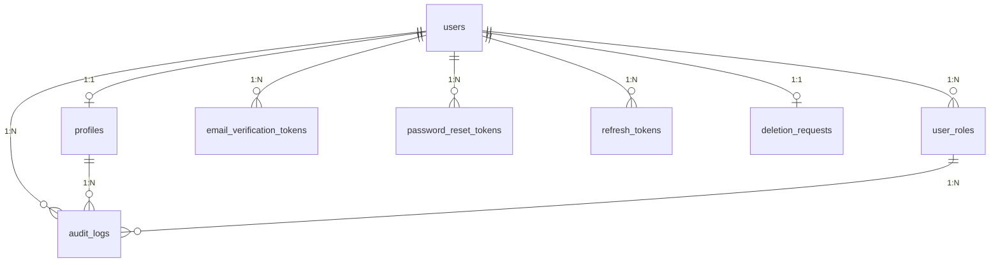

# Modelo de Datos — Identity & Users

> **Feature:** F001 - Registro, Autenticacion y Perfiles de Usuario
> **Bounded Context:** Identity & Users (Core)
> **Schema PostgreSQL:** `identity`
> **Stack:** EF Core 10 + PostgreSQL 16
> **Ultima actualizacion:** 2026-07-19

---

## 1. Diagrama de Entidades



---

## 2. Tablas del Schema `identity`

### 2.1 `users`

Entidad raiz del agregado `UserProfile`. Representa un usuario registrado en la plataforma.

| Columna | Tipo | Constraints | Descripcion |
|---------|------|-------------|-------------|
| `id` | `UUID` | `PK DEFAULT gen_random_uuid()` | Identificador unico |
| `email` | `VARCHAR(255)` | `NOT NULL UNIQUE` | Email del usuario |
| `email_verified` | `BOOLEAN` | `NOT NULL DEFAULT false` | Indica si el email ha sido verificado |
| `auth_provider` | `VARCHAR(20)` | `NOT NULL DEFAULT 'Email'` | Proveedor de autenticacion (`Email`, `Google`, `Microsoft`, `Facebook`, `Instagram`) |
| `auth0_user_id` | `VARCHAR(255)` | `NULLABLE` | ID del usuario en Auth0 (para OAuth) |
| `password_hash` | `VARCHAR(255)` | `NULLABLE` | Hash BCrypt de la contrasena (NULL para usuarios OAuth puros) |
| `failed_login_attempts` | `INTEGER` | `NOT NULL DEFAULT 0` | Contador de intentos fallidos de login |
| `locked_until` | `TIMESTAMPTZ` | `NULLABLE` | Fin del bloqueo temporal por intentos fallidos |
| `is_active` | `BOOLEAN` | `NOT NULL DEFAULT true` | Indica si la cuenta esta activa |
| `created_at` | `TIMESTAMPTZ` | `NOT NULL DEFAULT NOW()` | Fecha de creacion |
| `last_login_at` | `TIMESTAMPTZ` | `NULLABLE` | Ultimo inicio de sesion |
| `updated_at` | `TIMESTAMPTZ` | `NOT NULL DEFAULT NOW()` | Ultima actualizacion |

**Indices**:

```sql
CREATE UNIQUE INDEX idx_users_email ON identity.users (LOWER(email));
CREATE INDEX idx_users_auth_provider ON identity.users (auth_provider);
CREATE INDEX idx_users_is_active ON identity.users (is_active) WHERE is_active = true;
```

**Trigger de updated_at**:

```sql
CREATE TRIGGER trg_users_updated_at
    BEFORE UPDATE ON identity.users
    FOR EACH ROW
    EXECUTE FUNCTION update_updated_at_column();
```

**RLS**: No aplica RLS directamente (los usuarios son globales, no por comunidad). En el futuro, podria filtrarse por comunidad via relacion indirecta desde `community.memberships`.

---

### 2.2 `profiles`

Perfil deportivo del usuario (relacion 1:1 con `users`). Se crea automaticamente al registrar.

| Columna | Tipo | Constraints | Descripcion |
|---------|------|-------------|-------------|
| `id` | `UUID` | `PK DEFAULT gen_random_uuid()` | Identificador unico |
| `user_id` | `UUID` | `NOT NULL UNIQUE FK → users(id) ON DELETE CASCADE` | Referencia al usuario |
| `display_name` | `VARCHAR(50)` | `NOT NULL` | Nombre visible publico |
| `avatar_url` | `VARCHAR(2048)` | `NULLABLE` | URL del avatar en CDN |
| `bio` | `VARCHAR(500)` | `NULLABLE` | Biografia |
| `skill_level` | `VARCHAR(20)` | `NULLABLE` | Nivel de habilidad auto-evaluado (`Beginner`, `Intermediate`, `Advanced`, `Expert`, `Professional`) |
| `assessed_at` | `TIMESTAMPTZ` | `NULLABLE` | Fecha de la ultima auto-evaluacion de skill |
| `primary_sport` | `VARCHAR(100)` | `NULLABLE` | Deporte principal |
| `created_at` | `TIMESTAMPTZ` | `NOT NULL DEFAULT NOW()` | Fecha de creacion |
| `updated_at` | `TIMESTAMPTZ` | `NOT NULL DEFAULT NOW()` | Ultima actualizacion |

**Indices**:

```sql
CREATE INDEX idx_profiles_display_name ON identity.profiles (display_name);
CREATE INDEX idx_profiles_skill_level ON identity.profiles (skill_level) WHERE skill_level IS NOT NULL;
CREATE INDEX idx_profiles_primary_sport ON identity.profiles (primary_sport) WHERE primary_sport IS NOT NULL;
```

**Trigger de updated_at**:

```sql
CREATE TRIGGER trg_profiles_updated_at
    BEFORE UPDATE ON identity.profiles
    FOR EACH ROW
    EXECUTE FUNCTION update_updated_at_column();
```

**RLS**: No aplica directamente.

---

### 2.3 `user_roles`

Roles globales asignados a los usuarios. Un usuario puede tener multiples roles.

| Columna | Tipo | Constraints | Descripcion |
|---------|------|-------------|-------------|
| `id` | `UUID` | `PK DEFAULT gen_random_uuid()` | Identificador unico |
| `user_id` | `UUID` | `NOT NULL FK → users(id) ON DELETE CASCADE` | Referencia al usuario |
| `role` | `VARCHAR(20)` | `NOT NULL` | Rol global (`Admin`, `Player`, `Captain`, `Coach`) |
| `assigned_by` | `UUID` | `NULLABLE FK → users(id)` | Usuario que asigno el rol (NULL si fue asignacion automatica) |
| `assigned_at` | `TIMESTAMPTZ` | `NOT NULL DEFAULT NOW()` | Fecha de asignacion |

**Indices**:

```sql
CREATE INDEX idx_user_roles_user_id ON identity.user_roles (user_id);
CREATE INDEX idx_user_roles_role ON identity.user_roles (role);
CREATE UNIQUE INDEX idx_user_roles_unique ON identity.user_roles (user_id, role);
```

**RLS**: No aplica directamente.

---

### 2.4 `email_verification_tokens`

Tokens para verificacion de email con expiracion de 24 horas.

| Columna | Tipo | Constraints | Descripcion |
|---------|------|-------------|-------------|
| `id` | `UUID` | `PK DEFAULT gen_random_uuid()` | Identificador unico |
| `user_id` | `UUID` | `NOT NULL FK → users(id) ON DELETE CASCADE` | Referencia al usuario |
| `token` | `VARCHAR(255)` | `NOT NULL UNIQUE` | Token de verificacion (hash) |
| `expires_at` | `TIMESTAMPTZ` | `NOT NULL` | Fecha de expiracion (24h desde creacion) |
| `used_at` | `TIMESTAMPTZ` | `NULLABLE` | Fecha de uso (NULL si no usado) |
| `created_at` | `TIMESTAMPTZ` | `NOT NULL DEFAULT NOW()` | Fecha de creacion |

**Indices**:

```sql
CREATE INDEX idx_email_verification_tokens_user_id ON identity.email_verification_tokens (user_id);
CREATE INDEX idx_email_verification_tokens_token ON identity.email_verification_tokens (token) WHERE used_at IS NULL;
CREATE INDEX idx_email_verification_tokens_expires ON identity.email_verification_tokens (expires_at) WHERE used_at IS NULL;
```

---

### 2.5 `password_reset_tokens`

Tokens para restablecimiento de contrasena con expiracion de 1 hora.

| Columna | Tipo | Constraints | Descripcion |
|---------|------|-------------|-------------|
| `id` | `UUID` | `PK DEFAULT gen_random_uuid()` | Identificador unico |
| `user_id` | `UUID` | `NOT NULL FK → users(id) ON DELETE CASCADE` | Referencia al usuario |
| `token` | `VARCHAR(255)` | `NOT NULL UNIQUE` | Token de reset (hash) |
| `expires_at` | `TIMESTAMPTZ` | `NOT NULL` | Fecha de expiracion (1h desde creacion) |
| `used_at` | `TIMESTAMPTZ` | `NULLABLE` | Fecha de uso (NULL si no usado) |
| `created_at` | `TIMESTAMPTZ` | `NOT NULL DEFAULT NOW()` | Fecha de creacion |

**Indices**:

```sql
CREATE INDEX idx_password_reset_tokens_user_id ON identity.password_reset_tokens (user_id);
CREATE INDEX idx_password_reset_tokens_token ON identity.password_reset_tokens (token) WHERE used_at IS NULL;
CREATE INDEX idx_password_reset_tokens_expires ON identity.password_reset_tokens (expires_at) WHERE used_at IS NULL;
```

---

### 2.6 `refresh_tokens`

Tokens de refresco para renovar access tokens JWT.

| Columna | Tipo | Constraints | Descripcion |
|---------|------|-------------|-------------|
| `id` | `UUID` | `PK DEFAULT gen_random_uuid()` | Identificador unico |
| `user_id` | `UUID` | `NOT NULL FK → users(id) ON DELETE CASCADE` | Referencia al usuario |
| `token` | `VARCHAR(255)` | `NOT NULL UNIQUE` | Refresh token (hash) |
| `device_info` | `VARCHAR(500)` | `NULLABLE` | Informacion del dispositivo/navegador |
| `expires_at` | `TIMESTAMPTZ` | `NOT NULL` | Fecha de expiracion |
| `revoked_at` | `TIMESTAMPTZ` | `NULLABLE` | Fecha de revocacion (NULL si activo) |
| `created_at` | `TIMESTAMPTZ` | `NOT NULL DEFAULT NOW()` | Fecha de creacion |

**Indices**:

```sql
CREATE INDEX idx_refresh_tokens_user_id ON identity.refresh_tokens (user_id);
CREATE INDEX idx_refresh_tokens_token ON identity.refresh_tokens (token) WHERE revoked_at IS NULL;
CREATE INDEX idx_refresh_tokens_active ON identity.refresh_tokens (user_id) WHERE revoked_at IS NULL;
```

---

### 2.7 `deletion_requests`

Solicitudes de eliminacion de cuenta con periodo de gracia.

| Columna | Tipo | Constraints | Descripcion |
|---------|------|-------------|-------------|
| `id` | `UUID` | `PK DEFAULT gen_random_uuid()` | Identificador unico |
| `user_id` | `UUID` | `NOT NULL UNIQUE FK → users(id) ON DELETE CASCADE` | Referencia al usuario |
| `requested_at` | `TIMESTAMPTZ` | `NOT NULL DEFAULT NOW()` | Fecha de solicitud |
| `confirmed_at` | `TIMESTAMPTZ` | `NULLABLE` | Fecha de confirmacion (via email) |
| `grace_period_end` | `TIMESTAMPTZ` | `NOT NULL` | Fin del periodo de gracia (7d desde confirmacion) |
| `cancelled_at` | `TIMESTAMPTZ` | `NULLABLE` | Fecha de cancelacion |
| `status` | `VARCHAR(20)` | `NOT NULL DEFAULT 'Pending'` | Estado (`Pending`, `Confirmed`, `Cancelled`, `Executed`) |
| `executed_at` | `TIMESTAMPTZ` | `NULLABLE` | Fecha de ejecucion de la anonimizacion |

**Indices**:

```sql
CREATE INDEX idx_deletion_requests_user_id ON identity.deletion_requests (user_id);
CREATE INDEX idx_deletion_requests_status ON identity.deletion_requests (status);
CREATE INDEX idx_deletion_requests_grace ON identity.deletion_requests (grace_period_end)
    WHERE status = 'Confirmed' AND cancelled_at IS NULL;
```

---

### 2.8 `audit_logs`

Registro inmutable de cambios criticos (cambios de rol, eliminacion, acciones administrativas).

| Columna | Tipo | Constraints | Descripcion |
|---------|------|-------------|-------------|
| `id` | `UUID` | `PK DEFAULT gen_random_uuid()` | Identificador unico |
| `user_id` | `UUID` | `NULLABLE FK → users(id)` | Usuario afectado (si aplica) |
| `action` | `VARCHAR(100)` | `NOT NULL` | Accion realizada (ej. `RoleChanged`, `AccountDeleted`, `DeletionRequested`) |
| `entity_type` | `VARCHAR(50)` | `NOT NULL` | Tipo de entidad (ej. `User`, `UserRole`, `Profile`) |
| `entity_id` | `VARCHAR(255)` | `NOT NULL` | ID de la entidad afectada |
| `old_value` | `JSONB` | `NULLABLE` | Valor anterior (para cambios) |
| `new_value` | `JSONB` | `NULLABLE` | Valor nuevo (para cambios) |
| `performed_by` | `UUID` | `NULLABLE FK → users(id)` | Usuario que realizo la accion |
| `performed_at` | `TIMESTAMPTZ` | `NOT NULL DEFAULT NOW()` | Momento de la accion |

**Indices**:

```sql
CREATE INDEX idx_audit_logs_user_id ON identity.audit_logs (user_id);
CREATE INDEX idx_audit_logs_action ON identity.audit_logs (action);
CREATE INDEX idx_audit_logs_performed_at ON identity.audit_logs (performed_at);
CREATE INDEX idx_audit_logs_entity ON identity.audit_logs (entity_type, entity_id);
```

**Nota**: La tabla `audit_logs` es de solo insercion (INSERT-only). No se permiten UPDATE ni DELETE a nivel de base de datos mediante triggers o politicas.

---

## 3. Funcion helper para `updated_at`

```sql
CREATE OR REPLACE FUNCTION update_updated_at_column()
RETURNS TRIGGER AS $$
BEGIN
    NEW.updated_at = NOW();
    RETURN NEW;
END;
$$ LANGUAGE plpgsql;
```

---

## 4. Estrategia de migraciones

Cada modulo tiene migraciones EF Core independientes en su proyecto de Infrastructure:

```
src/Modules/Identity/SportHub.Identity.Infrastructure/
  Persistence/
    Migrations/
      0001_InitialCreate.cs
      0002_AddRefreshTokens.cs
      0003_AddDeletionRequests.cs
      ...
```

**Convenciones**:

- El `DbContext` del modulo Identity se llama `IdentityDbContext`.
- Se configura con `builder.HasDefaultSchema("identity")`.
- Las migraciones se generan con:
  ```bash
  dotnet ef migrations add {MigrationName} \
    --project src/Modules/Identity/SportHub.Identity.Infrastructure \
    --startup-project src/Api/SportHub.Api
  ```
- Las entidades se configuran via `IEntityTypeConfiguration<T>` (Fluent API) en carpeta `Persistence/Configurations/`.
- Shadow properties: `CreatedAt` y `UpdatedAt` se configuran globalmente en `IdentityDbContext.OnModelCreating`.

---

## 5. Value Objects (mapeo en EF Core)

| Value Object | Propiedades | Mapeo EF Core |
|-------------|-------------|---------------|
| `SkillLevel` | `Value` (string), `AssessedAt` (DateTime?) | JSON column en `profiles` (`owned type`) o columnas directas |
| `PasswordHash` | `Value` (string) | Columna directa `password_hash` en `users` |
| `EmailAddress` | `Value` (string) | Columna directa `email` en `users` con validacion de formato |

---

## 6. Relaciones con otros bounded contexts

| Bounded Context | Relacion | Tipo |
|----------------|----------|------|
| **Community** | `users.id` referenciado como `memberships.user_id` en schema `community` | Logica (sin FK fisica) |
| **Leaderboards** | `users.id` referenciado como `xp_records.user_id` en schema `economy` | Logica (sin FK fisica) |
| **Notifications** | `users.id` referenciado como `notifications.user_id` en schema `notifications` | Logica (sin FK fisica) |
| **Events** | `users.id` referenciado como `check_ins.user_id` en schema `events` | Logica (sin FK fisica) |

> **Importante**: Por decision arquitectonica (ADR-003), no existen Foreign Keys fisicas entre schemas. Las relaciones entre bounded contexts se manejan a nivel logico/aplicacion. Cada schema es independiente y las referencias se validan en la capa de aplicacion mediante eventos de dominio y consultas via API Gateway.

---

## 7. Estrategia de anonimizacion (GDPR)

Cuando se ejecuta la eliminacion definitiva de una cuenta (US-010), el proceso realiza:

1. `profiles.display_name` → `'Usuario Eliminado'`
2. `profiles.avatar_url` → `NULL`
3. `profiles.bio` → `NULL`
4. `users.email` → `SHA256(email + salt)` (hash irreversible)
5. `users.email_verified` → `false`
6. `users.password_hash` → `NULL`
7. `users.auth0_user_id` → `NULL`
8. `users.is_active` → `false`
9. `deletion_requests.status` → `'Executed'`

Se preservan:
- `users.id` (UUID anonimo)
- `profiles.id` (UUID anonimo)
- Registros en leaderboards, XP, asistencias, insignias (datos agregados sin PII)

---

## 8. Consideraciones de performance

| Tabla | Tamano estimado (MVP) | Estrategia |
|-------|-----------------------|------------|
| `users` | 100K filas | Indices en email, auth_provider. Particionamiento no requerido en MVP. |
| `profiles` | 100K filas | 1:1 con users. Indice en display_name para busquedas. |
| `user_roles` | 150K filas | Un usuario puede tener ~1.5 roles promedio. Indice compuesto (user_id, role). |
| `refresh_tokens` | 500K+ filas | Limpieza periodica de tokens expirados/revocados via background job (Hangfire). |
| `audit_logs` | 1M+ filas | Solo INSERT. Particionamiento por mes recomendado desde el inicio. |

**Limpieza programada**:

```sql
-- Job diario: eliminar tokens expirados hace mas de 30 dias
DELETE FROM identity.refresh_tokens
WHERE (expires_at < NOW() - INTERVAL '30 days')
   OR (revoked_at IS NOT NULL AND revoked_at < NOW() - INTERVAL '30 days');

-- Job diario: tokens de verificacion expirados > 7 dias
DELETE FROM identity.email_verification_tokens
WHERE expires_at < NOW() - INTERVAL '7 days';

-- Job diario: tokens de reset expirados > 7 dias
DELETE FROM identity.password_reset_tokens
WHERE expires_at < NOW() - INTERVAL '7 days';
```

---

## 9. Enumeraciones compartidas

### `AuthProvider`
```csharp
public enum AuthProvider { Email, Google, Microsoft, Facebook, Instagram }
```

### `GlobalRole`
```csharp
public enum GlobalRole { Admin, Player, Captain, Coach }
```

### `SkillLevel`
```csharp
public enum SkillLevel { Beginner, Intermediate, Advanced, Expert, Professional }
```

### `DeletionRequestStatus`
```csharp
public enum DeletionRequestStatus { Pending, Confirmed, Cancelled, Executed }
```
